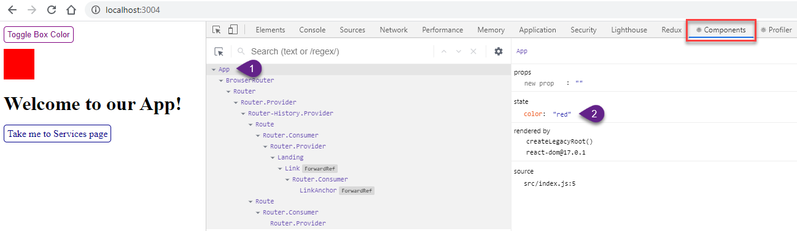

# State Checker

This app was created to demonstrate the concept that if the App component is at the top of the hierarchy, any state that it possesses will not be lost as a user navigates to other pages.

## How to Run App

After you have initially downloaded the source code, you will need to switch into the state-checker folder and run...

### `npm install`

...to create the node_modules folder filled with package dependencies. Then, at a command prompt within the state-checker folder, enter:

### `npm start`

This will launch the development server and run the app in development mode in the your default web browser at URL [http://localhost:3000](http://localhost:3000).

The page will reload if you make edits to the code.

## How to Check State in App Component

To see the state contained in the App component, you need the **React Developer Tools** browser extension installed. In the Chrome browser, you can search the Chrome Web Store at:

`chrome://extensions/`

You can also access the React Developer Tools extension directly at URL:

https://chrome.google.com/webstore/detail/react-developer-tools/fmkadmapgofadopljbjfkapdkoienihi?hl=en

Install and enable this extension. You then launch the Chrome Developer Tools in your Chrome browser (F12 in Windows, navigate via hamburger icon in Mac) and switch to the **Components** tab on the far right (the tabs are Elements, Console, Sources, etc., then Components comes up).

## Using App

Initially when the app loads and you have the browser developer tools open to the Components tab, the screen resembles the image below.

*Disregard the fact that in the screen shot above, my React app is loaded at port 3004 instead of 3000 cited in the documentation above. I had four other React apps running at the time and 3004 was the next available port.*

There is a red box on the screen and you are on the landing page which contains a welcome message and a button to take you to the Services page.

From the Components tab of the React Developer Tools browser extension, select App at top of component hierarchy. Take note that the state initially specifies:

`color: "red"`

Now, if you click on the **Toggle Box Color** button, the box color changes to purple and the App state shows:

`color: "purple"`

*If you still see red, this just means the React browser extension did not refresh the screen. Simply click on another component in the hierarchy and then return to App.*

Now, click on the **Take me to Services page** button. You will leave the Landing page, as evidenced by a console log message and arrive at the Services page which has a message to inform you where you are and a button to return home.

Take a look at the state in the App component and you will see that his has not changed, it still says that the color property is purple.

This simple experiment demonstrates that the top level App component does not lose state when changing pages.